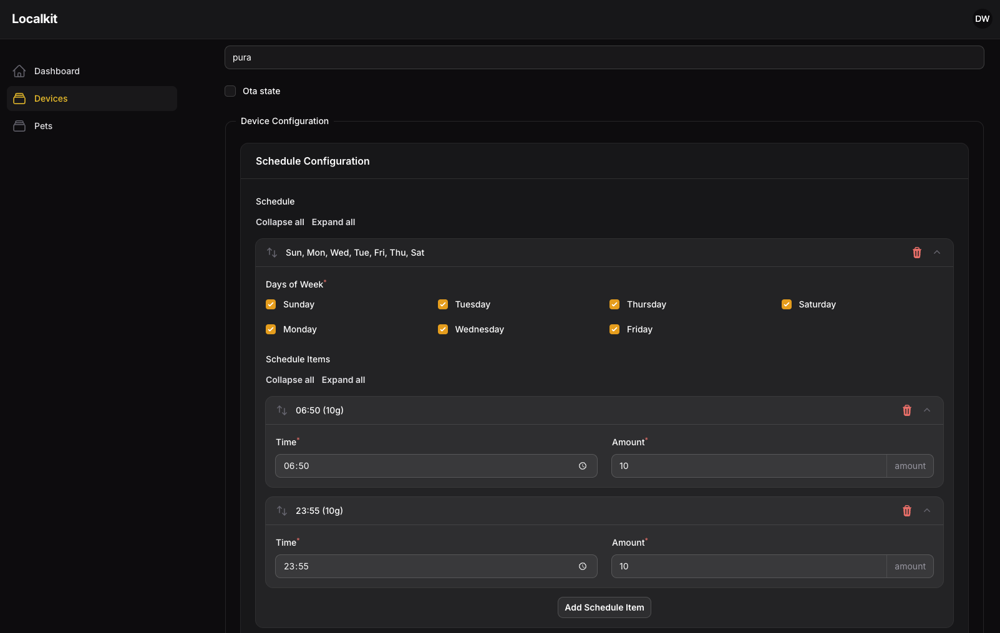
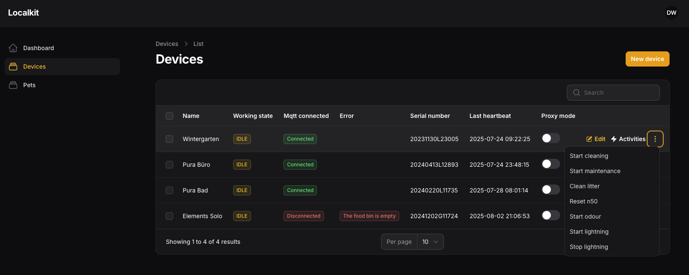
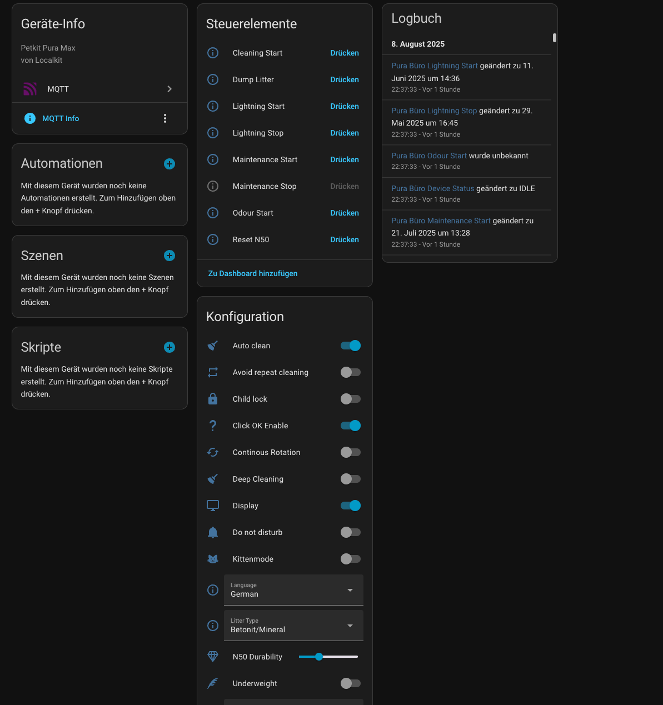
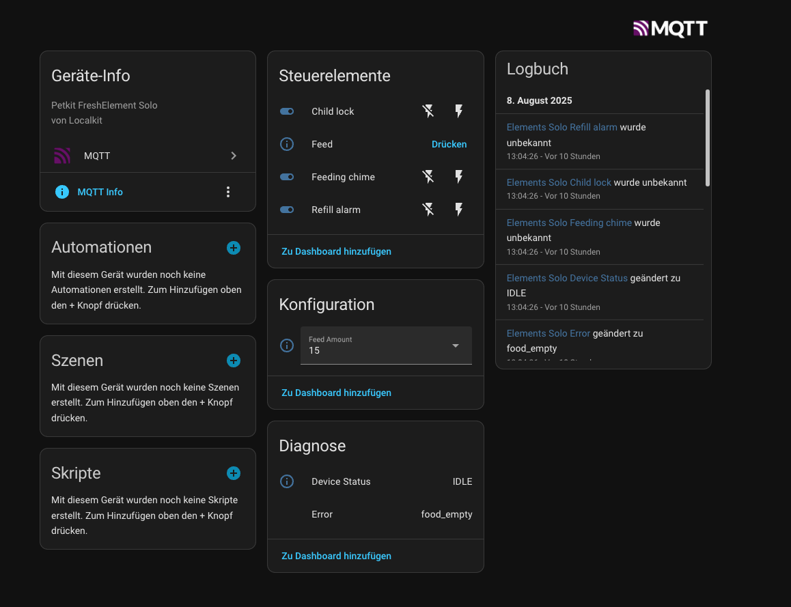

# Localkit

This project aims to provide local control of Petkit devices. It communicates directly with your devices on your local network and creates entities in Home Assistant over MQTT for seamless integration.

## Requirements

As an internal MQTT broker, [localkit-broker](https://github.com/dwyschka/localkit-broker) is required for the system to function correctly.

## Configuration

The configuration is handled via your `.env` file. You can use the following variables:

| Variable | Description | Default |
|---|---|---|
| `PETKIT_LOCAL_IP` | The local IP address of your Petkit device. | `127.0.0.1` |
| `HOMEASSISTANT_DISCOVERY_PREFIX` | The Home Assistant MQTT discovery prefix. | `homeassistant` |
| `BYPASS_AUTH` | Bypass authentication for development or testing. | `true` |
| `BYPASS_AUTH_ID` | The user ID to use when authentication is bypassed. | `1` |

## Supported Devices

### Petkit Pura Max

**Sensors:**
- Error status
- Device Status
- Litter Weight & Percentage
- Used Times
- N50 deodorant durability (in days)
- K3 Battery & Liquid percentage

**Switches:**
- Child lock
- Display on/off
- Auto clean
- Continuous Rotation
- Avoid repeat cleaning
- Underweight pet detection
- Kitten mode
- Do not disturb mode
- Deep Cleaning

**Controls:**
- **Buttons:** Start/Stop Maintenance, Start/Stop Lightning, Start Odour Removal, Start Cleaning, Dump Litter, Reset N50
- **Selects:** Litter Type, Unit (kg/lb), Language
- **Number:** Set N50 Durability (in days)

### Petkit Element Fresh Solo

**Sensors:**
- Error status
- Device Status

**Switches:**
- Refill alarm
- Feeding chime
- Child lock

**Controls:**
- **Button:** Manual Feed
- **Select:** Feed Amount (in grams)

# Screenshots
## Panel

## Homeassistant

